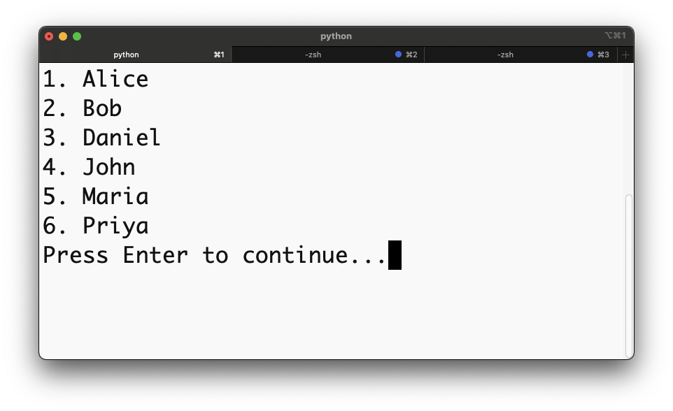
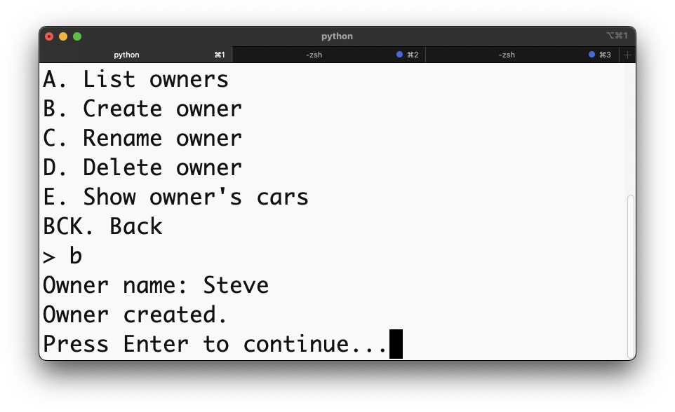
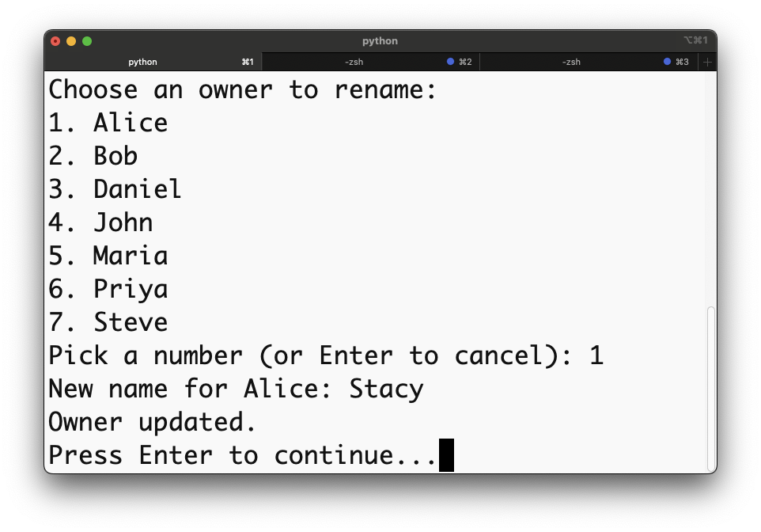
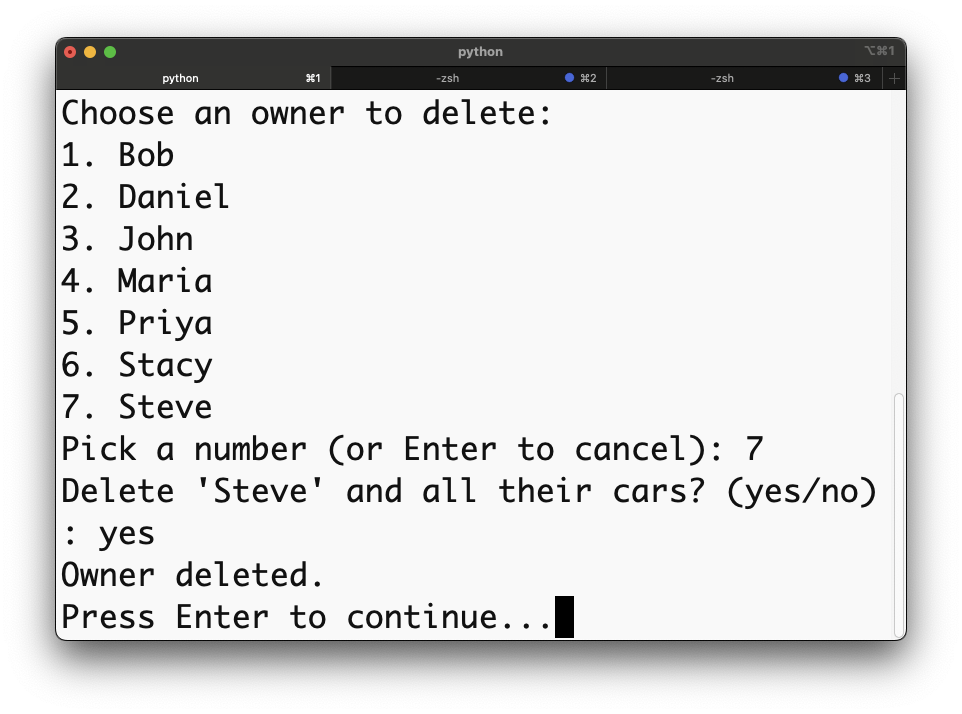
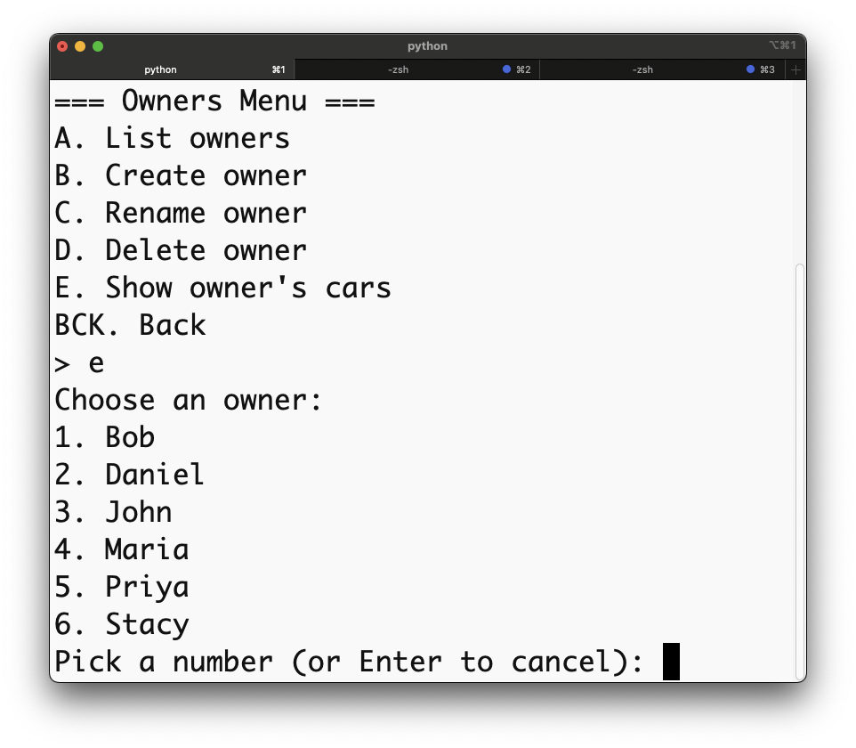
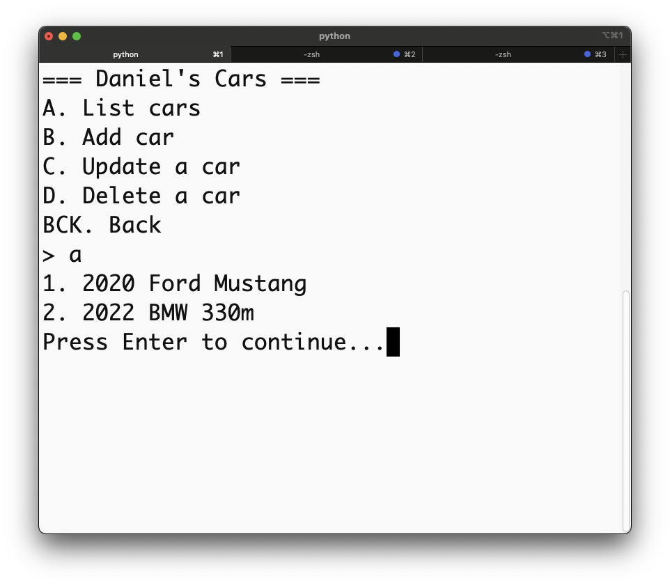

# Owners & Cars CLI

## 🧭 Project Overview

**Owners & Cars CLI** is a Python Command Line Interface (CLI) app for managing a simple one-to-many relationship — one **Owner** can have many **Cars**.
It uses **SQLite** as a local database and demonstrates **Object-Relational Mapping (ORM)** concepts implemented through Python classes.
Users can perform CRUD operations (Create, Read, Update, Delete) via an interactive text-based interface.


   ```bash
   # 1. Install dependencies
   pipenv install
   ```

   ```bash
   # 2. Activate the virtual environment
   pipenv shell
   ```

   ```bash
   # 3. Run the CLI
   python -m lib.cli
   ```


### 📁 File Structure
```bash
├── Pipfile
├── Pipfile.lock
├── README.md
└── lib
    ├── cli.py          # Main command-line interface logic
    ├── helpers.py      # Input prompts, validation, and screen clearing
    ├── db.sqlite3      # SQLite database file
    └── models
        ├── __init__.py
        ├── owner.py    # Owner class: defines owner attributes and relationships
        └── car.py      # Car class: defines car attributes and links to owner
```

### 🧩 Key Features

	•	Interactive CLI with text menus for managing owners and cars.

	•	CRUD functionality for both entities.

	•	Automatic database setup on first run.

	•	Clean modular code using OOP and ORM concepts.

	•	User-friendly prompts and dynamic lists.

### 📸 Demo Screenshots

#### 1. Main Menu


The starting screen of the CLI app, showing the top-level options — access the Owners menu or Exit the program.

#### 2. Owners Menu


*The Owners Menu allows you to list, create, rename, or delete owners, as well as view each owner’s cars.*

#### 3. List of Owners



*Displays all existing owners in the system. This menu updates dynamically when owners are added or removed.*

#### 4. Create Owner



*Example of creating a new owner. The app prompts for the name, saves it to the database, and confirms creation.*

#### 5. Rename Owner



*Demonstrates how an existing owner’s name can be changed. The user selects an owner and enters a new name.*

#### 6. Delete Owner



*Example of deleting an owner. The app asks for confirmation before removing the owner and their cars from the database.*

#### 7. Owner’s Cars Menu



*After selecting an owner, this submenu provides options to list, add, update, or delete cars belonging to that owner.*

#### 8. List of Cars



*Displays all cars for the selected owner, including model and year.*

### 🏁 Conclusion  

This CLI project showcases:
- Implementation of a **one-to-many relationship** in Python  
- Integration of **OOP** with an **SQLite relational database**  
- Design of a **user-friendly CLI interface**

It reinforces Phase 3 core concepts — **classes**, **ORM**, and **CRUD operations**.