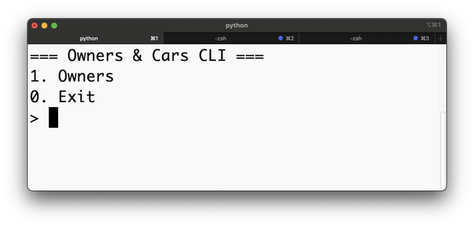

# Owners & Cars CLI

## 🧭 Project Overview

**Owners & Cars CLI** is a Python Command Line Interface (CLI) app for managing a simple one-to-many relationship — one **Owner** can have many **Cars**.
It uses **SQLite** as a local database and demonstrates **Object-Relational Mapping (ORM)** concepts implemented through Python classes.
Users can perform CRUD operations (Create, Read, Update, Delete) via an interactive text-based interface.


   ```bash
   # 1. Install dependencies
   pipenv install
   ```

   ```bash
   # 2. Activate the virtual environment
   pipenv shell
   ```

   ```bash
   # 3. Run the CLI
   python -m lib.cli
   ```

#### 🧩 Debug Mode (Optional)
    
```bash
python lib/debug.py
```

### 📁 File Structure
```bash
├── Pipfile
├── Pipfile.lock
├── README.md
└── lib
    ├── cli.py          # Main command-line interface logic
    ├── helpers.py      # Input prompts, validation, and screen clearing
    ├── db.sqlite3      # SQLite database file
    └── models
        ├── __init__.py
        ├── owner.py    # Owner class: defines owner attributes and relationships
        └── car.py      # Car class: defines car attributes and links to owner
```

### 🧩 Key Features

	•	Interactive CLI with text menus for managing owners and cars.

	•	CRUD functionality for both entities.

	•	Automatic database setup on first run.

	•	Clean modular code using OOP and ORM concepts.

	•	User-friendly prompts and dynamic lists.

### 📸 Demo Screenshots

#### 1. Main Menu



The starting screen of the CLI app, showing the top-level options — access the Owners menu or Exit the program.


---

### 📘 References

This project builds on concepts introduced in the Flatiron School curriculum.  
In particular, it was inspired by the **Mapping Object Relationships: Code-Along** lab,  
which demonstrates how to implement one-to-many relationships using ORM techniques.

🔗 [Mapping Object Relationships: Code-Along (Flatiron School)](https://learning.flatironschool.com/courses/8415/assignments/2997467/module_item_id=743033)